# Sons of Birka

Birka is regarded as Sweden’s first city.

Birka is an ancient Viking Age trading center located on the beautiful island of Björkö in Lake Mälaren. It was an important hub for trade and cultural exchange in the 8th to 10th centuries, and was designated a UNESCO World Heritage Site in 1993. The site contains the remains of over 700 Viking Age buildings, including a large market square, a harbor, and numerous workshops and residences.

Birka is considered one of the most significant archaeological sites in Sweden, and has provided important insights into the daily lives and culture of the Vikings.

## Ordinals collection
Sons of Birka is a collection of 19 Cyber Vikings stored on the Bitcoin blockchain.

### #1 Oden 151821

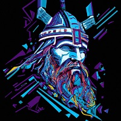

id: 83cd1a93ac756af25ecab544392d4a1874adb340f6e23cd330208d58ffbf3b8ci0

link: https://ordinalswallet.com/inscription/83cd1a93ac756af25ecab544392d4a1874adb340f6e23cd330208d58ffbf3b8ci0

The name "Oden" refers to the chief deity in Norse mythology, also known as Odin in English. Odin was regarded as the god of wisdom, war, death, poetry, and magic, among other things. He was considered the most powerful of the Norse gods and was associated with a number of symbols, including the ravens Huginn and Muninn, the wolf Fenrir, and the spear Gungnir. In Norse mythology, Odin was also known for his quest for knowledge and his willingness to make sacrifices in pursuit of wisdom.

The name "Oden" or "Odin" is still used today in some Scandinavian countries as a given name for boys.

### #2 Tor 181807

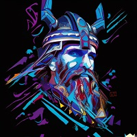

id: 5460de670c3c1d7bffcd57a80790df9052dda497be0a6debbd28b70527a5e3bci0

link: https://ordinalswallet.com/inscription/5460de670c3c1d7bffcd57a80790df9052dda497be0a6debbd28b70527a5e3bci0

The name "Tor" refers to the god of thunder in Norse mythology, also known as Thor in English. Thor was considered one of the most powerful of the Norse gods and was associated with thunder, lightning, storms, and strength. He was often depicted wielding his signature weapon, the hammer Mjölnir, and riding in a chariot pulled by two goats. Thor was also considered a protector of humanity and was known for his bravery and fighting spirit.

The name "Tor" or "Thor" is still used today in some Scandinavian countries as a given name for boys.

### #3 Loke 181545

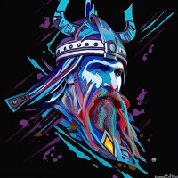

id: efe36025a1ee408a9b5f993c0653e36530c74689ab28e53cd0b7cd5b16d20f3di0

link: https://ordinalswallet.com/inscription/efe36025a1ee408a9b5f993c0653e36530c74689ab28e53cd0b7cd5b16d20f3di0

The name "Loke" refers to a complex figure in Norse mythology, also known as Loki in English. Loki was a trickster god and a shape-shifter who often caused chaos and mischief among the other gods. He was associated with fire, magic, and deception, and was known for his wit and cunning. Despite his often disruptive behavior, Loki was also considered a companion and ally of the other gods, and was sometimes called upon to help them in times of need. In Norse mythology, Loki played a pivotal role in a number of key events, including the death of the god Balder and the events leading up to Ragnarok, the end of the world.

The name "Loke" or "Loki" is still used today in some Scandinavian countries as a given name for boys, although its popularity has varied over time

### #4 Frej 181813

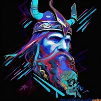

id: 875f68afc522ec5041631e0dacc3b182826389a3391d34d2d16c5c4ee1b928c0i0

link: https://ordinalswallet.com/inscription/875f68afc522ec5041631e0dacc3b182826389a3391d34d2d16c5c4ee1b928c0i0

The name "Frej" refers to the god of fertility, prosperity, and love in Norse mythology, also known as Freyr in Old Norse. Frej was associated with agriculture, wealth, and peace, and was often depicted holding a magical sword and riding on a boar named Gullinbursti. He was also associated with the sun and was sometimes called upon for his power to bring light and warmth to the world. In Norse mythology, Frej was regarded as a benevolent and generous deity who was loved and revered by both gods and humans alike.

The name "Frej" or "Freyr" is still used today in some Scandinavian countries as a given name for boys.

### #5 Birk 186813

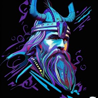

id: 150a77bc4b8f8d47594fda821ea171782edff2cc332a1ae70ed32d917a96efbdi0

link: https://ordinalswallet.com/inscription/150a77bc4b8f8d47594fda821ea171782edff2cc332a1ae70ed32d917a96efbdi0

The name "Birk" is a Scandinavian name that derives from the Old Norse word "birki", meaning "birch tree". The birch tree has been a significant symbol in Scandinavian culture for centuries and is associated with renewal, growth, and resilience.

The name "Birk" is typically used as a given name for boys and is relatively uncommon, but has gained popularity in recent years in some Scandinavian countries. It can also be spelled "Birch" in English.

### #6 Harald 186506

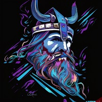

id: 788f13cadf016b110f15671dcb55feaa7d471aeceda7df35e4f035daef840dfei0

link: https://ordinalswallet.com/inscription/788f13cadf016b110f15671dcb55feaa7d471aeceda7df35e4f035daef840dfei0

The name "Harald" is a Scandinavian name that derives from the Old Norse name "Haraldr", which means "army leader" or "ruler of an army". The name was popular among Scandinavian nobility and royalty, and was borne by several famous historical figures, including Harald Bluetooth, the Viking king who united Denmark and Norway in the 10th century, and Harald Hardrada, the Norwegian king who famously invaded England in 1066.

The name "Harald" is typically used as a given name for boys and is still popular in Scandinavian countries today. It has also been used as a surname in some English-speaking countries.

### #7 Björn 186505

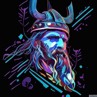

id: 13ae70885327429d82df58feee138484201ec2ac222a0e01a923f59235feb5fbi0

link: https://ordinalswallet.com/inscription/13ae70885327429d82df58feee138484201ec2ac222a0e01a923f59235feb5fbi0

The name "Björn" is a Scandinavian name that derives from the Old Norse word "bjǫrn", meaning "bear". The bear has been a significant symbol in Scandinavian culture for centuries and is associated with strength, courage, and protection. The name "Björn" was popular among Viking Age warriors and is still a common given name for boys in Scandinavia today. It has also been used as a surname in some English-speaking countries. The name is often shortened to "Bjorn" in English.

### #8 Leif 186504

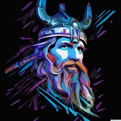

id: 138d4f7a189d76873083f4ea14a8c5ee31f0a8c1a5611ec25e24f80e2e9dd7fai0

link: https://ordinalswallet.com/inscription/138d4f7a189d76873083f4ea14a8c5ee31f0a8c1a5611ec25e24f80e2e9dd7fai0

The name "Leif" is a Scandinavian name that derives from the Old Norse name "Leifr", which means "heir" or "descendant". The name was popular among Viking Age Scandinavians and was borne by several famous historical figures, including Leif Erikson, the Norse explorer who is credited with discovering North America around the year 1000. The name "Leif" is typically used as a given name for boys and is still popular in Scandinavian countries today. It has also been used as a surname in some English-speaking countries. The name is pronounced "layf" in Scandinavian languages and "life" in English.

### #9 Birger 186502

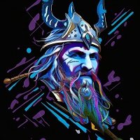

id: 4306fc6343e0edb650cc46c97c4ce2cca9c49918c81fabd1f1fd87852a982ce4i0

link: https://ordinalswallet.com/inscription/4306fc6343e0edb650cc46c97c4ce2cca9c49918c81fabd1f1fd87852a982ce4i0

The name "Birger" is a Scandinavian name that derives from the Old Norse name "Birgir", which means "helper" or "supporter". The name was popular among Viking Age Scandinavians and was borne by several historical figures, including Birger Jarl, a medieval Swedish statesman who is credited with founding Stockholm.

The name "Birger" is typically used as a given name for boys and is still popular in Scandinavia today. It can also be spelled "Birgir" or "Birgeri" in some Scandinavian languages. The name is pronounced "beer-ger" in Swedish and "beer-gur" in Icelandic.

### #10 Anund 186500

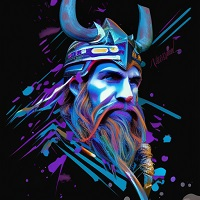

id: e278f965ff0c95bfe0959830f481b0195328b49747176cc9f3d469ab6df91ae1i0

link: https://ordinalswallet.com/inscription/e278f965ff0c95bfe0959830f481b0195328b49747176cc9f3d469ab6df91ae1i0

The name "Anund" is a Scandinavian name that derives from the Old Norse name "Anundr", which means "gift of grace" or "gracious gift". The name was popular among Viking Age Scandinavians and was borne by several historical figures, including Anund Jacob, a medieval Swedish king who ruled in the 11th century.

The name "Anund" is typically used as a given name for boys and is still used in Scandinavia today, although it is relatively uncommon. It can also be spelled "Anundr" or "Annund" in some Scandinavian languages. The name is pronounced "ah-nund" in Swedish and "ah-nundr" in Icelandic.

### #11 Ulvar 186499

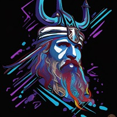

id: 6305fac896601e4fff2248269e3c5f3d79ec669f7dc6c17ee9a30ba1a7db10ddi0

link: https://ordinalswallet.com/inscription/6305fac896601e4fff2248269e3c5f3d79ec669f7dc6c17ee9a30ba1a7db10ddi0

The name "Ulvar" is a Scandinavian name that is derived from the Old Norse word "ulfr", which means "wolf". The wolf was a significant symbol in Viking Age Scandinavia, representing strength, courage, and loyalty.

The name "Ulvar" is typically used as a given name for boys and is still used in some Scandinavian countries today, although it is relatively uncommon. It can also be spelled "Ulvarr" or "Ulvare" in some Scandinavian languages. The name is pronounced "ool-var" in Swedish and "ool-vahr" in Icelandic.

### #12 Rune 186497

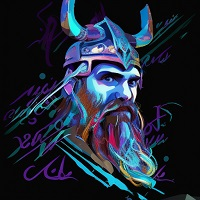

id: 225b7600d2591f24ab5b9644750e6abef1db85e8b3d094f3dd33e53be15b52c4i0

link: https://ordinalswallet.com/inscription/225b7600d2591f24ab5b9644750e6abef1db85e8b3d094f3dd33e53be15b52c4i0

The name "Rune" is a Scandinavian name that derives from the Old Norse word "rún", which means "secret" or "mystery". In Viking Age Scandinavia, runes were a writing system used to convey messages and symbols of power and magic. The name "Rune" was used in reference to those who had knowledge of these symbols and could read and interpret them.

The name "Rune" is typically used as a given name for boys and is still used in Scandinavia today, although it is relatively uncommon. It can also be spelled "Runar" or "Runi" in some Scandinavian languages. The name is pronounced "roo-neh" in Swedish and "roo-nuh" in Icelandic.

### #13 Olof 186494

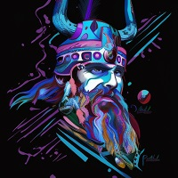

id: 5adab1a948411678afd75653df9e9d6ce7b6e88ea17e25ae2c807c759bfa87aei0

link: https://ordinalswallet.com/inscription/5adab1a948411678afd75653df9e9d6ce7b6e88ea17e25ae2c807c759bfa87aei0

The name "Olof" is a Scandinavian name that derives from the Old Norse name "Anulfr", which means "ancestor wolf". The name "Olof" is derived from the Old Norse name "Áleifr", which means "ancestor's descendant" or "forefather's heir".

The name was popular among Viking Age Scandinavians and is still a common given name for boys in Scandinavia today. It can also be spelled "Olaf" or "Olov" in some Scandinavian languages. The name is pronounced "oh-lov" in Swedish and "oh-lov" or "oh-lahf" in Icelandic.

### #14 Grim 186489

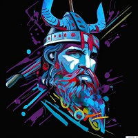

id: 91780415887ebf5c0fee5706582bc166eff1e315e0eba68460361ad3b11feb65i0

link: https://ordinalswallet.com/inscription/91780415887ebf5c0fee5706582bc166eff1e315e0eba68460361ad3b11feb65i0

The name "Grim" is a Scandinavian name that derives from the Old Norse word "grimmr", which means "grim", "severe" or "fierce". The name was popular among Viking Age Scandinavians and was often used as a nickname for those who were known for their fierce or intimidating nature.

The name "Grim" is typically used as a given name for boys and is still used in Scandinavia today, although it is relatively uncommon. It can also be spelled "Grym" in some Scandinavian languages. The name is pronounced "grihm" in Swedish and "grim" in Icelandic.

### #15 Njord 186484

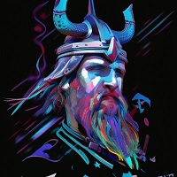

id: e9e018ad228027df6e9ce114fb7877dea640ac40e71939bf6f4fb360161dd336i0

link: https://ordinalswallet.com/inscription/e9e018ad228027df6e9ce114fb7877dea640ac40e71939bf6f4fb360161dd336i0

The name "Njord" is a Scandinavian name that derives from the Old Norse god of the same name. In Norse mythology, Njord was the god of the sea, winds, and fishing. He was also associated with wealth, fertility, and prosperity.

The name "Njord" is typically used as a given name for boys in Scandinavian countries and is still used today, although it is relatively uncommon. It can also be spelled "Njörðr" in some Scandinavian languages. The name is pronounced "nyord" in Swedish and "nyorth" in Icelandic.

### #16 Ragnar 186483

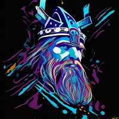

id: 8d8f15ddd64961ba4f32cf9c0a61b0b9fa59d940e1c9d979c8f1c6e31f5ee233i0

link: https://ordinalswallet.com/inscription/8d8f15ddd64961ba4f32cf9c0a61b0b9fa59d940e1c9d979c8f1c6e31f5ee233i0

The name "Ragnar" is a Scandinavian name that derives from the Old Norse name "Ragnarr", which means "warrior" or "judgment warrior". The name was popular among Viking Age Scandinavians and was borne by several historical figures, including legendary Viking chieftain Ragnar Lothbrok. 

The name "Ragnar" is typically used as a given name for boys and is still used in Scandinavia today, although it is relatively uncommon. It can also be spelled "Ragnarr" or "Ragner" in some Scandinavian languages. The name is pronounced "rahg-nar" in Swedish and "rahg-nahr" in Icelandic.

### #17 Sven 186482

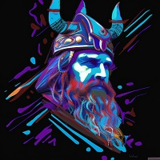

id: b92ef1db45d30c470289e7dccde3bd6bd077a31591047398f9b634efd9520929i0

link: https://ordinalswallet.com/inscription/b92ef1db45d30c470289e7dccde3bd6bd077a31591047398f9b634efd9520929i0

The name "Sven" is a Scandinavian name that derives from the Old Norse name "Sveinn", which means "young man" or "young warrior". The name was popular among Viking Age Scandinavians and was borne by several historical figures, including the legendary Danish king Sven Forkbeard.

The name "Sven" is typically used as a given name for boys and is still used in Scandinavia today, although it is relatively uncommon. It can also be spelled "Svend" or "Svein" in some Scandinavian languages. The name is pronounced "svayn" in Swedish and "sveyn" in Icelandic.

### #18 Tyr 186478

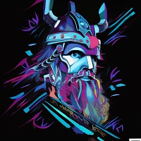

id: 44fc2caded64469682152fe22d39024d914548ca7ba8ed64420a360f6c872f0ci0

link: https://ordinalswallet.com/inscription/44fc2caded64469682152fe22d39024d914548ca7ba8ed64420a360f6c872f0ci0

The name "Tyr" is a Scandinavian name that derives from the Old Norse god of the same name. In Norse mythology, Tyr was the god of war, law, and justice. He was known for his bravery and for sacrificing his hand to help bind the monstrous wolf Fenrir.

The name "Tyr" is typically used as a given name for boys in Scandinavia and is still used today, although it is relatively uncommon. It can also be spelled "Týr" or "Tyr" in some Scandinavian languages. The name is pronounced "teer" in Swedish and "teer" or "teerth" in Icelandic.

### #19 Sten 186479

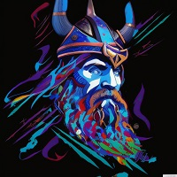

id: 3b176378789459a1d15b960b407a2a5eeb1559c9cdbd89282b9ca85a86709714i0

link: https://ordinalswallet.com/inscription/3b176378789459a1d15b960b407a2a5eeb1559c9cdbd89282b9ca85a86709714i0

The name "Sten" is a Scandinavian name that derives from the Old Norse word "steinn", which means "stone". The name was popularized in Scandinavia during the medieval period and became a common given name for boys

The name "Sten" is still used in Scandinavia today, although it is less common than some other names. It can also be spelled "Stein" or "Steen" in some Scandinavian languages. The name is pronounced "sten" in Swedish and "steyn" in Icelandic.
